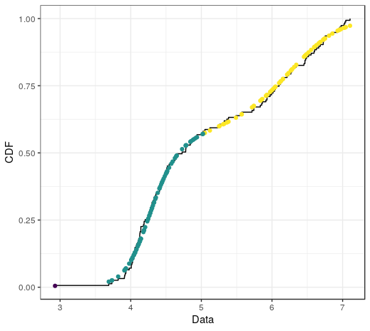

# BNPdensity

A fork of the BNPdensity package from CRAN (https://cran.r-project.org/web/packages/BNPdensity/index.html)

## How to use the convergence diagnostics

We rely on the convergence diagnostics included in the package `coda` by Martyn Plummer. We only convert the output of multiple chains into an mcmc.object.

One detail is that due to the Nonparametric nature of the model, the number of parameters which could potentially be monitored for convergence of the chains varies. 
The location parameter of the clusters, for instance, vary at each iteration, and even the labels of the clusters vary, which makes them tricky to follow.
However, it is possible to monitor the log-likelihood of the data along the iterations, the value of the latent variable `u`, the number of components and for the semi-parametric model, the value of the common scale parameter.

```
library(BNPdensity)
library(coda)
data(acidity)
fitlist = multMixNRMI1(acidity, extras = TRUE)
mcmc_list = convert_to_mcmc(fitlist)
coda::traceplot(mcmc_list)
coda::gelman.diag(mcmc_list)
```


## How to use the Goodness of fit plots

### Non censored data
```
library(BNPdensity)
data(acidity)
fit = MixNRMI1(acidity, extras = TRUE)
plotGOF(fit)
```


### Censored data
```
library(BNPdensity)
data(salinity)
fit = MixNRMI1cens(salinity$left,salinity$right, extras = TRUE)
plotGOF(fit)
```


# Posterior analysis of the clustering structure

The MCMC algorithm provides a sample of the posterior distribution on the space of all clusterings. 
This is a very large discrete space, which is not ordered. 
This means that for any reasonably sized problem, each configuration in the posterior will have been explored no more than once or twice, and that many potentially good configurations will not be present in the MCMC sample.
Moreover, the lack of ordering makes it not trivial to summarise the posterior by an optimal clustering and to provide credible sets.

We suggest using the approach developped in S. Wade and Z. Ghahramani, “Bayesian cluster analysis: Point estimation and credible balls (with discussion),” Bayesian Anal., vol. 13, no. 2, pp. 559–626, 2018.

The main proposal from this paper is to summarise the posterior on all possible clusterings by an optimal clustering where optimality is defined as minimising the posterior expectation of a specific loss function, the Variation of Information.
Credible sets are also available.


Using this approach requires installing the R package `mcclust-ext`, which can be achieved with the following command from the `devtools` package:

```
devtools::install_url("http://wrap.warwick.ac.uk/71934/1/mcclust.ext_1.0.tar.gz")
```

Note that investigating the clustering makes more sense for the fully Nonparametric NRMI model than for the Semiparametric.
This is because to use a single scale parameters for all the clusters, the Semiparametric model may favour numerous small clusters, for flexibility.
The larger number of clusters may render interpretation of the clusters more challenging.

The clustering structure may be visualised as follows:

```
data(acidity)
out <- MixNRMI2(acidity,  extras = TRUE)
clustering = compute_optimal_clustering(out)
plot_clustering_and_CDF(out, clustering)
```

