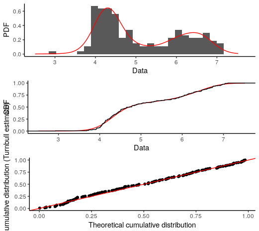
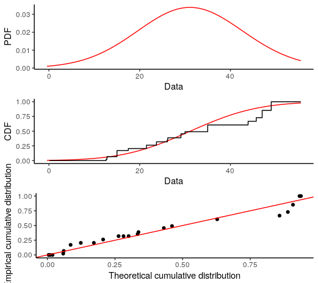

# BNPdensity

A fork of the BNPdensity package from CRAN (https://cran.r-project.org/web/packages/BNPdensity/index.html)

## How to use the convergence diagnostics

We rely on the convergence diagnostics included in the package `coda` by Martyn Plummer. We only convert the output of multiple chains into an mcmc.object.

One detail is that due to the Nonparametric nature of the model, the number of parameters which could potentially be monitored for convergence of the chains varies. 
The location parameter of the clusters, for instance, vary at each iteration, and even the labels of the clusters vary, which makes it tricky to follow.
However, it is possible to monitor the log-likelihood of the data along the iterations, the value of the latent variable `u`, the number of components and for the semi-parametric model, the value of the common scale parameter.

```
library(BNPdensity)
library(coda)
data(acidity)
fitlist = multMixNRMI1(acidity, extras = TRUE)
mcmc_list = convert_to_mcmc(fitlist)
coda::traceplot(mcmc_list)
coda::gelman.diag(mcmc_list)
```


## How to use the Goodness of fit plots

### Non censored data
```
library(BNPdensity)
data(acidity)
fit = MixNRMI1(acidity, extras = TRUE)
plotGOF(fit)
```



### Censored data
```
library(BNPdensity)
data(salinity)
fit = MixNRMI1cens(salinity$left,salinity$right, extras = TRUE)
plotGOF(fit)
```



