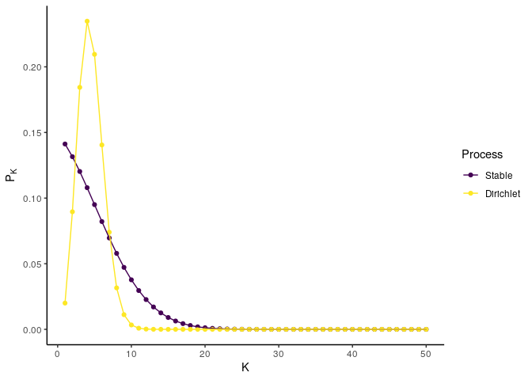

<!-- README.md is generated from README.Rmd. Please edit that file -->

# BNPdensity

Bayesian nonparametric density estimation modeling mixtures by a
Ferguson-Klass type algorithm for posterior normalized random measures.

## Installation

You can install BNPdensity from github with:

``` r
# install.packages("devtools")
devtools::install_github("konkam/BNPdensity")
```

You will need to have the CRAN package `devtools`
installed.

## How to select the parameters of the Normalized Generalised Gamma process

We suggest the Normalised stable process, which corresponds to setting
`Alpha = 1, Kappa = 0` in the `MixNRMIx` functions. The stable process
is a convenient model because its parameter γ has a convenient
interpretation: it can be used to tune how informative the prior on the
number of components is. Small values of `Gama` bring the process closer
to a Dirichlet process, where the prior on the number of components is a
relatively peaked distribution around \(\alpha \log n\). Larger values
of `Gama` make this distribution flatter. More guidelines on how to
choose the parameters may be found in Lijoi et al. (2007b), notably by
considering the expected prior number of components.

We provide a function to compute the expected number of components for a
normalised stable process:

``` r
library(BNPdensity)
expected_number_of_components_stable(100, 0.8)
#> 1 'mpfr' number of precision  5300   bits 
#> [1] 42.7094763347433063870164430179377602285097873537020509591067085108693089953308485568922629628925609670388816355409267145879811608727979635644774974037316163731591853953068391985644986476120011372960450707841949357628205832352455972108307720257846739029935831367778087474278900096286104350854420468743750780953727437388381753822866058766720173377298935849197133078525375521665344039604097969307794640101701067874475659220445305472235893927481095361462556416422489918801010270531398200441645390722656975243565592756687766475481859394293400264017298519219232910313654037149553666679890694710843958583376865920388291893659788102528801718172192946031922288386233821810410501186383355395149325749466413257183113733305353511545188982744656555395398972901331812210878443370420188050079296961588354717569901177367135749962447447224416420675294481931830396470678197938068495726792098492301861867848615495349033316737274460428156601729995582227093984927573684202948081480326602431090471715657360243449939490449356101843512114863960991112163052180595493138738154009570051440201734910690675439847222404185487749697490650751441315028511680962275697544876381547502701669182191631474532044540652445597534524514603751379272059519507131686466715577223976517034749060430770136897413866748560250530215650470272587207144490882254716255834420821791362584492810869968198190988785738412008821209902657920643493452437754796309886438135090613667172496645250319489253659479224616599473806695684422970882485107803951463342178330568302659987687979181789280041582895452379211397819039874690441241818137403032383618941916951949
```

This number may be compared to the prior number of components induced by
a Dirichlet process with `Alpha = 1`:

``` r
expected_number_of_components_Dirichlet(100, 1.)
#> [1] 5.187378
```

We also provide a way to visualise the prior distribution on the number
of components:

``` r
plot_prior_number_of_components(50, 0.4)
```

<!-- -->

## How to use the convergence diagnostics

We rely on the convergence diagnostics included in the package `coda` by
Martyn Plummer. We only convert the output of multiple chains into an
mcmc object.

One detail is that due to the Nonparametric nature of the model, the
number of parameters which could potentially be monitored for
convergence of the chains varies. The location parameter of the
clusters, for instance, vary at each iteration, and even the labels of
the clusters vary, which makes them tricky to follow. However, it is
possible to monitor the log-likelihood of the data along the iterations,
the value of the latent variable `u`, the number of components and for
the semi-parametric model, the value of the common scale parameter.

``` r
library(BNPdensity)
library(coda)
data(acidity)
fitlist = multMixNRMI1(acidity, Nit = 5000)
mcmc_list = convert_to_mcmc(fitlist)
coda::traceplot(mcmc_list)
```

<!-- --><!-- --><!-- --><!-- -->

``` r
coda::gelman.diag(mcmc_list)
#> Potential scale reduction factors:
#> 
#>                 Point est. Upper C.I.
#> ncomp                 1.01       1.03
#> Sigma                 1.02       1.06
#> Latent_variable       1.01       1.03
#> log_likelihood        1.01       1.03
#> 
#> Multivariate psrf
#> 
#> 1.02
```

## How to use the Goodness of fit plots

### Non censored data

``` r
library(BNPdensity)
data(acidity)
fit = MixNRMI1(acidity, extras = TRUE)
#> MCMC iteration 500 of 1500 
#> MCMC iteration 1000 of 1500 
#> MCMC iteration 1500 of 1500 
#>  >>> Total processing time (sec.):
#>    user  system elapsed 
#>  47.404   0.045  47.454
plotGOF(fit)
#> `stat_bin()` using `bins = 30`. Pick better value with `binwidth`.
```

<!-- -->

### Censored data

``` r
library(BNPdensity)
data(salinity)
fit = MixNRMI1cens(salinity$left,salinity$right, extras = TRUE)
#> MCMC iteration 500 of 1500 
#> MCMC iteration 1000 of 1500 
#> MCMC iteration 1500 of 1500 
#>  >>> Total processing time (sec.):
#>    user  system elapsed 
#>  52.482   0.000  52.486
plotGOF(fit)
```

<!-- -->

## Posterior analysis of the clustering structure

The MCMC algorithm provides a sample of the posterior distribution on
the space of all clusterings. This is a very large discrete space, which
is not ordered. This means that for any reasonably sized problem, each
configuration in the posterior will have been explored no more than once
or twice, and that many potentially good configurations will not be
present in the MCMC sample. Moreover, the lack of ordering makes it not
trivial to summarise the posterior by an optimal clustering and to
provide credible sets.

We suggest using the approach developped in S. Wade and Z. Ghahramani,
“Bayesian cluster analysis: Point estimation and credible balls (with
discussion),” Bayesian Anal., vol. 13, no. 2, pp. 559–626, 2018.

The main proposal from this paper is to summarise the posterior on all
possible clusterings by an optimal clustering where optimality is
defined as minimising the posterior expectation of a specific loss
function, the Variation of Information. Credible sets are also
available.

We use the implementation described in R. Rastelli and N. Friel,
“Optimal Bayesian estimators for latent variable cluster models,”
Stat. Comput., vol. 28, no. 6, pp. 1169–1186, Nov. 2018, which is faster
and implemented in the CRAN package `GreedyEPL`.

Using this approach requires installing the R package `GreedyEPL`, which
can be achieved with the following command:

``` r
install.packages("GreedyEPL")
```

Note that investigating the clustering makes more sense for the fully
Nonparametric NRMI model than for the Semiparametric. This is because to
use a single scale parameters for all the clusters, the Semiparametric
model may favour numerous small clusters, for flexibility. The larger
number of clusters may render interpretation of the clusters more
challenging.

The clustering structure may be visualised as follows:

``` r
data(acidity)
out <- MixNRMI2(acidity,  extras = TRUE)
#> MCMC iteration 500 of 1500 
#> MCMC iteration 1000 of 1500 
#> MCMC iteration 1500 of 1500 
#>  >>> Total processing time (sec.):
#>    user  system elapsed 
#>  25.062   0.132  25.197
clustering = compute_optimal_clustering(out)
plot_clustering_and_CDF(out, clustering)
```

<!-- -->
